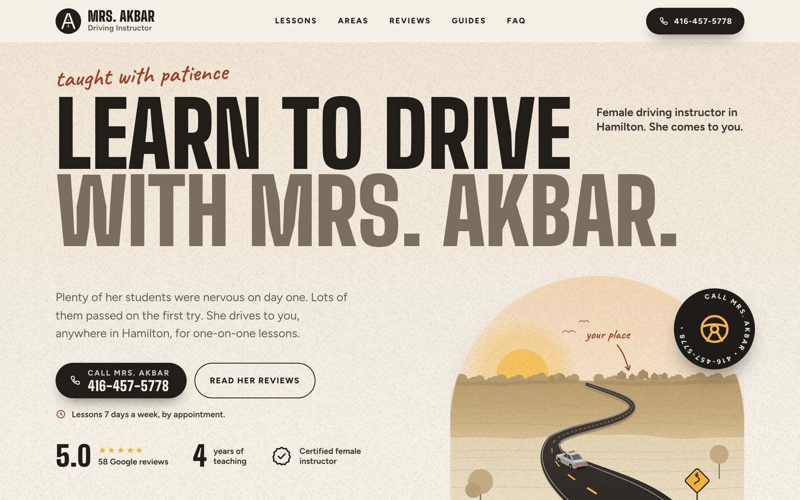
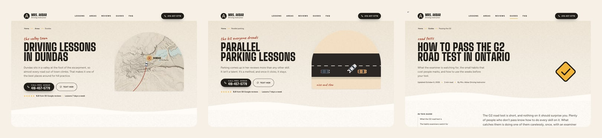
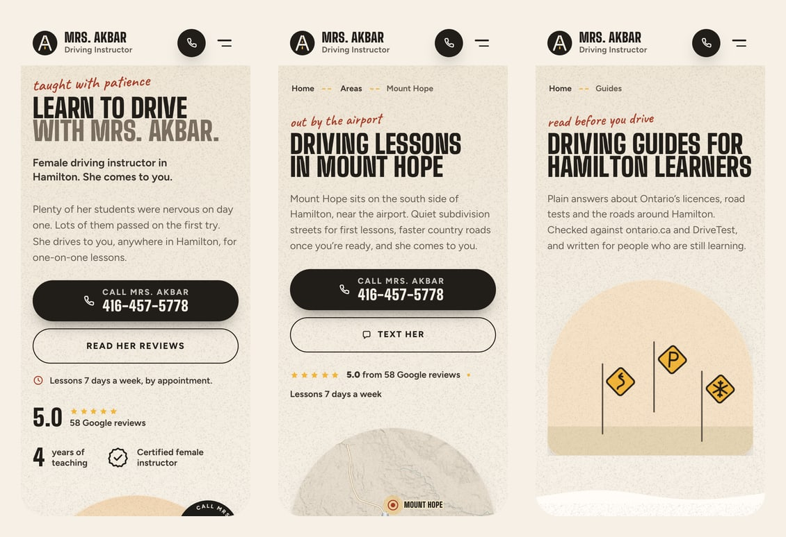

<div align="center">

# Mrs. Akbar Driving Instructor

**One-on-one driving lessons across Hamilton, Ontario, with a certified female instructor who comes to you.**

[**Visit the live site**](https://www.mrsakbardriving.ca/) &nbsp;·&nbsp; Call or text **416-457-5778**

</div>







## At a glance

- **49 pages:** the home page, 5 lesson pages, 8 area pages, 30 guides and a guides index, contact,
  a Privacy Policy, Terms and Conditions, and a custom 404.
- **Fast:** Lighthouse performance 98 to 100 on phones and 100 on desktop, with no layout shift.
  Each page inlines only the CSS it uses.
- **Accessible:** no axe violations on any page, keyboard friendly, and every animation switches off
  for visitors who ask for reduced motion.
- **Private:** no cookies, analytics or third-party requests.
- **Checked on every screen:** small phones, the iPhone Duo (folded and open), tablets, laptops, and
  34", 37" and 49" ultrawide monitors.
- **Honest content:** every review quote is word for word from her Google reviews and links to that
  exact review. Road rules were checked against ontario.ca and drivetest.ca, local roads against
  OpenStreetMap.

## Commands

```bash
npm install          # once
npm run dev          # generate the pages, then local development at http://127.0.0.1:5173
npm run build        # generate pages and share images, then the production build into dist/
npm run preview      # serve the production build (this machine uses port 4188)
npm run validate     # build, then validate every HTML page
npm run pages        # only regenerate the pages and share images
npm run assets       # regenerate terrain, maps, hero art, QR codes, photos and icons
npm run indexnow     # after a deploy: tell Bing and other IndexNow engines about every page
```

## How it goes live

The site is hosted on **Vercel**, connected to this repository. Every push to `main` builds and
publishes it automatically at **https://www.mrsakbardriving.ca/**; other branches get preview
links. Build settings, caching and security headers live in `vercel.json`, along with a
permanent redirect that sends anyone on the old `mrsakbardriving.vercel.app` address to the
same page on `www.mrsakbardriving.ca`. `mrsakbardriving.ca` (no www) forwards there too.

The address lives in one place, `VITE_SITE_URL` in `.env`. Canonical tags, Open Graph URLs,
structured data, `sitemap.xml`, `robots.txt` and `llms.txt` all follow it.

**Changing the domain:** add the new one in Vercel under **Settings > Domains**, change
`VITE_SITE_URL` in `.env` and the redirect destination in `vercel.json`, and push.

## Search engines

1. **Google Search Console:** add a URL-prefix property for the live address, choose the
   "HTML tag" method, paste the code into `VITE_GSC_VERIFICATION` in `.env`, push, then press Verify.
   Submit `https://www.mrsakbardriving.ca/sitemap.xml` under Sitemaps.
2. **Bing Webmaster Tools:** import the site from Search Console (or use `VITE_BING_VERIFICATION`),
   submit the sitemap, then run `npm run indexnow`.
3. Add the website address to her Google Business Profile.

## Before telling everyone

1. **Google Business Profile:** she drives to her students, so Google's guidelines say to hide the
   street address on the profile and list service areas instead. The website already does this.
2. Have Mrs. Akbar read the Privacy Policy and Terms and Conditions and confirm they match how she
   works (record keeping, cancellations, refunds). Have a lawyer review them if possible.
3. Confirm that 416-457-5778 receives texts (the site offers texting as well as calling), and that the
   two students in the pass-day photos are happy to appear on the site.

## Pages

| Type | Pages | Where the content lives |
| --- | --- | --- |
| Home | `/` | `index.html` (hand-written) |
| Lessons (5) | beginner, nervous drivers, G2, G and highway, parallel parking | `scripts/site/pages-services.mjs` |
| Areas (8) | Hamilton, Mount Hope, Ancaster, Dundas, Stoney Creek, Binbrook, Caledonia, near McMaster | `scripts/site/pages-areas.mjs`, `areas-content.mjs` |
| Guides (30 + index) | `/guides/...` | `scripts/site/guide-list.mjs` (order and section), `pages-guides.mjs`, `guides-start.mjs`, `guides-rules.mjs`, `guides-skills.mjs`, `guides-tests.mjs`, `guide-mountain.mjs` |
| Contact, Privacy Policy, Terms and Conditions | `/contact/`, `/privacy-policy/`, `/terms-and-conditions/` | `pages-contact.mjs`, `pages-legal.mjs` |
| 404 | `404.html` (never indexed) | `pages-404.mjs` |

`scripts/site/build.mjs` generates all of them (plus the shared header, footer, menu and floating
buttons that the home page includes) from one layout, so navigation never drifts apart. Generated
pages are written to `src/pages/` and published at clean URLs such as `/guides/how-to-parallel-park/`.
Edit the generator files, not `src/pages/` (it isn't in the repository; every build recreates it).

The header links to Home, a Lessons menu that lists all five lesson pages, Areas, Reviews, Guides
and FAQ; the phone menu has the same links, with Lessons as an expandable list. The guides index
groups the guides into Getting started, Rules of the road, Skills, Road tests and Hamilton roads,
following each guide's `cat` in `scripts/site/guide-list.mjs`. Guide tables, practice quizzes and
road sign drawings come from `scripts/site/guide-kit.mjs` and `scripts/site/road-signs.mjs`.

## Keeping it current

- **Review count:** update `VITE_GOOGLE_REVIEWS` in `.env` as reviews arrive, then push.
- **Review quotes** must be word for word. All 58 Hamilton reviews (text and Google review IDs) are in
  `data/reviews-hamilton.json`; pages quote them through `review()` in `scripts/site/core.mjs`, which
  stops the build if a quote doesn't match the review exactly. Every quote links to that exact review.
- **"Every one of her reviews is five stars"** was true on 2026-10-06 (58 of 58). If a review below
  five stars arrives, change that sentence in `index.html`.
- **Rules and DriveTest details** in the guides were checked on 2026-10-06 and 2026-10-07 against
  ontario.ca, ontario.ca/laws, drivetest.ca and the other sources listed at the end of each guide.
  Licensing rules, fines and insurance rules change; recheck them every year and update the dates in
  the guides.
- **"Four years in business"** was true in 2026. Update it each year (home page, guides, JSON-LD).
- **She comes to you:** the site never presents a home base or distances from one. Keep it that way.
- **Business name and phone** must stay identical to the Google Business Profile.

## SEO set-up

- Unique title, meta description, canonical URL, Open Graph and Twitter tags on every page, and a
  share image per page (`public/og/`, built by `scripts/build-og.mjs` on every build).
- Structured data on every page: `LocalBusiness` + `EducationalOrganization` with every area it
  serves, `WebPage`, `BreadcrumbList`, plus `Service` (lessons and areas), `Article` (guides),
  `FAQPage` where a page has questions, `ItemList` (guides index) and `ContactPage`.
- `sitemap.xml`, `robots.txt` and `llms.txt` are generated at build time from the page list.

## Facts used on the site, and where they came from

| Fact | Source |
| --- | --- |
| Name, phone, hours, 5.0 rating, 58 reviews (all five stars) | Google Business Profile (Hamilton), checked 2026-10-06 |
| 5.0 rating from 108 reviews, Brampton | Her former Google Business Profile |
| First name Nuzhat | Named by reviewers |
| Four years in business | Provided by the client |
| She drives to her students | Provided by the client, 2026-10-06 |
| Licensing, road test and DriveTest rules | ontario.ca, the Official MTO Driver's Handbook and drivetest.ca (paraphrased, never copied) |
| Winter tire insurance discount | fsrao.ca and Ontario Regulation 664 |
| Red Hill Valley Parkway speed limit | hamilton.ca |
| Local roads and places on the area pages | OpenStreetMap |
| Map geography and terrain | OpenStreetMap contributors (ODbL); Mapzen Terrain Tiles with information licensed under the Open Government Licence (Canada); credits shown under the map |

By design there is **no photo or likeness of Mrs. Akbar anywhere** on the site. Claims that could not
be verified (prices, pass rates, BDE approval, vehicle details, languages) are not made. The original
student photos stay off this repository; the site uses the web-sized copies in `public/img/`.

## Service areas

Mount Hope, Hamilton, Ancaster, Stoney Creek, Dundas, Binbrook, Glanbrook, Westdale (including the
McMaster University area), Hamilton Mountain, Downtown Hamilton, East Hamilton, West Hamilton and
Caledonia. Keep the area groups, map (`scripts/build-map.mjs`), FAQ, footer, structured data
(`SERVICE_AREAS` in `scripts/site/core.mjs` and `areaServed` in `index.html`) and `llms.txt` in step
when the list changes.
